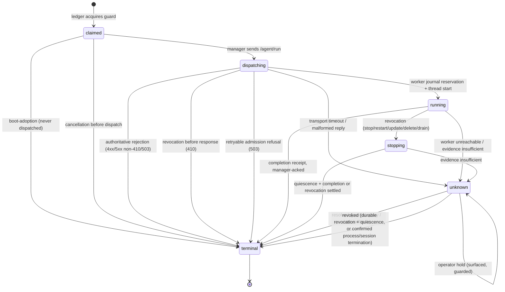
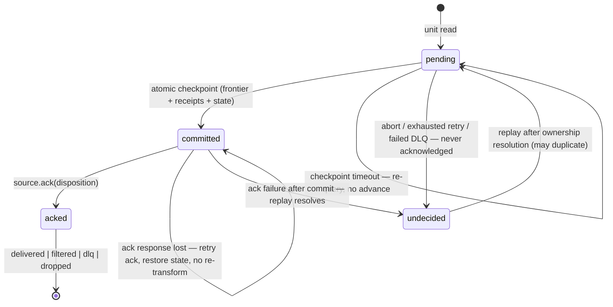

# V18-01 — Frozen contracts: identity, execution ledger, worker journal, protocol, and fault harness

Decision date: 2026-10-08. Status: frozen for v1.8.0 Waves 1–5. Baseline: v1.7.0 /
commit `8e128dd`. Source: [v1.8.0 implementation plan](v1.8.0-reliability-performance-plan.md)
A–F; [worker/pipeline review](../reviews/worker-pipeline-reliability-performance-2026-10-08.md) R1–R16.
Independent contract review: [review and disposition](../reviews/v18-01-contracts-independent-review.md).

**Freeze discipline.** "Frozen" binds V18-02 … V18-10: deviations require a written
review disposition against this document before the affected PR merges. "Pending —
decide by <test>" names the compatibility test that must conclude before the value
binds; until then implementations use the stated provisional value and must not
depend on it. This document owns the plan's Wave-0 decisions: unknown-exit
enumeration, authorization/watermark parameters plus the recorded fallback, all
config names, protocol capability set, confirmation-tier assignments, and the
reference fault-harness and measurement specs.

## 1. Identity model

| Field | Format | Generated by | Travels on |
|---|---|---|---|
| `run_id` | UUID4 string (existing, `tram/core/context.py:32`) | Controller (`trigger_run`, `controller.py:542`; `_run_batch`), unchanged generation sites | Every dispatch, state row, callback, completion, queue row, API receipt |
| `attempt_id` | `run_id + "-a" + N`, N = 1-based decimal ordinal, unpadded | Ledger, at guard acquisition and at each authorized replacement | Dispatch, journal reservation, status items, stop, run-complete, checkpoint, query/replay |
| `generation` | Per-pipeline integer, starts at 1, incremented on every config update (via `controller.update`, `pipelines.py:243`) and on delete tombstone | Ledger, stored in `pipeline_desired_state` | Dispatch, callbacks, transform-state PUT, checkpoints; compared on every mutation |
| `config_sha256` | Existing 16-hex prefix of YAML (`agent/server.py:513`) | Dispatching side | Dispatch and status items (unchanged); content fingerprint, never a substitute for `generation` |
| `slot_id` | `{placement_group_id}/s{index}` for broadcast streams; `single` for count=1 streams; empty string for batches | Controller at placement creation (`controller.py:1578`) | Stream dispatch, guards, status, completion |
| `worker_id` | Existing `node_id` | Deployment | All worker endpoints (unchanged) |
| `session_id` | `{worker_id}-{boot_uuid8}`; boot UUID minted once per process start; journal persists a monotonically increasing `session_epoch` alongside | Worker at boot | `/agent/handshake`, `/agent/status`, run-complete, journal rows |
| `fence_token` | UUID4 per attempt | Ledger at attempt creation | Authorizes manager-mediated state writes (transform-state PUT, checkpoint commits); not honored by external sinks — documented limit |

Uniqueness: `(run_id, N)` is unique in the ledger; `attempt_id` is globally unique
because `run_id` is UUID4. A retry inside the run keeps its attempt; only a
ledger-authorized replacement mints `N+1` under the same `run_id` (plan A). The
manager never reissues an authorization for a retired `attempt_id`; replacements
always carry a new one.

## 2. Attempt state machine



Transition table — every state×event is either listed here or **undefined and
forbidden**; code must reject unlisted transitions (enforced by the frozen
conditional-UPDATE transition statement in section 3; CHECK constraints
validate the value domain only):

| From | Event | Actor | Guard / identity compared | To |
|---|---|---|---|---|
| — | claim | Manager (ledger txn) | `execution_guards` row free or held by same `attempt_id`; queue reservation converts to guard | `claimed` |
| `claimed` | dispatch sent | Manager | attempt_id = guard's attempt_id; generation = current | `dispatching` |
| `claimed` | manager crash → boot adoption | Manager | no dispatch row for attempt (dispatch_sent_at IS NULL) → local resolution, **never** `unknown`, never collides with a replacement | `terminal` (outcome `aborted`, reason `manager_lost_before_dispatch`) |
| `claimed` | operator stop/restart/update/delete before dispatch | Manager | dispatch_sent_at IS NULL | `terminal` (outcome `aborted`, reason `cancelled_before_dispatch`) |
| `dispatching` | journal reservation + thread | Worker | authorization valid; no tombstone; reservation atomic | `running` |
| `dispatching` | HTTP 4xx/5xx (non-410/503) before acceptance | Manager | response is authoritative rejection | `terminal` (outcome `failed`, reason `dispatch_rejected`); guard released |
| `dispatching` | HTTP 410 revoked | Manager | revocation tombstone echoed | `terminal` (outcome `aborted`, reason `revoked_before_acceptance`); guard released |
| `dispatching` | HTTP 503 admission closed (journal unavailable/full, slots exhausted) | Manager | retryable — healthy-but-full is not worker failure (plan F) | attempt `terminal` with a capacity reason; run intent left unresolved — redispatch as a new attempt or queue re-entry per the one-pending-manual-run policy |
| `dispatching` | revocation arriving while the POST is in flight | Manager | worker-side tombstone still enforced — the delayed POST cannot start | `terminal` (outcome `aborted`, reason `revoked_before_acceptance`) |
| `dispatching` | manager crash → boot adoption | Manager | resolve against the worker journal by run ID before any scheduler fires | `terminal` (resolved or revoked per journal evidence) |
| `dispatching` | timeout / malformed | Manager | transport uncertainty is not rejection | `unknown` |
| `running` | revocation received | Worker | attempt_id matches reservation | `stopping` |
| `running` | completion acked | Manager | run-complete matches exact attempt_id + generation; guard still held by it | `terminal` |
| `running` | probe fails once / worker unreachable | Manager | insufficient evidence (plan D) | `unknown` |
| `stopping` | quiescence (threads joined or deadline) + journal completion | Worker → Manager | attempt_id match | `terminal` |
| `stopping` | deadline exceeded, adapter blocked | Worker | reports deadline_exceeded; guard retained | `unknown` |
| `unknown` | journal query / late callback returns result | Manager | conditional update on exact attempt | `terminal` (resolved) |
| `unknown` | durable revocation + quiescence, or confirmed worker process/session termination (newer `session_id` for same worker_id; pod-deletion alone is not proof) | Manager | revocation tombstone + journal absent/resolved, or new session observed | `terminal` (revoked) |
| `unknown` | operator hold | Operator | surfaced action; guard retained | `unknown` (held) |
| `unknown` | probe recovers active evidence | Manager | diagnostics only — no state change until a terminal resolution | `unknown` (retained) |
| `unknown` | blind redispatch | any | **forbidden** — invariant 5 | — |

Additional frozen rules: a terminal attempt's result is immutable; late/duplicate
callbacks for it record only their own attempt diagnostics and cannot touch a
newer guard, status, or generation (`controller.py:1417` name-keyed pop is the
defect being replaced). Within-attempt processing/commit retries never change
state. On `dispatching → running`, the journal reservation is worker-side; the
ledger's attempt row advances when the manager receives the 202 acceptance or a
status snapshot confirming it — the worker never writes the ledger. A queued
(pending) request holds a queue reservation, not the guard; it acquires the
guard only at claim — this preserves today's one-pending-manual-run
policy while closing the R4/R9 overlap windows.

## 3. Manager execution ledger (SQLite + PostgreSQL)

Additive, versioned migrations extend `tram/persistence/db.py::_create_tables`
(L131) using the existing `_add_column_if_missing` (L118) helper and
dialect-branching conventions (L63, L120, L237, L428). Timestamps stay TEXT
ISO-8601 UTC per the existing convention; new DDL is written once, portable
across both dialects, with the dialect-specific claims below. Legacy tables
(`run_history`, `broadcast_placements`, `queued_runs`, `transform_state`) remain
readable throughout; nothing is relabeled replay-safe (plan upgrade gate 1).

**MySQL disposition (frozen).** v1.7 documents a MySQL deployment option
(`docs/deployment.md` `mysql+pymysql` URL; `db.py` branches on `mysql` at L437,
L489, L510), but v1.8.0 supports SQLite and PostgreSQL only (plan A names both
supported dialects). A v1.8 manager started with a MySQL `TRAM_DB_URL` fails
closed at startup with an explicit unsupported-dialect message, and the
`docs/deployment.md` migration note directs operators to migrate to PostgreSQL
before upgrading. The frozen DDL above is not valid on MySQL (`TEXT PRIMARY KEY`
without key length; no `INSERT … ON CONFLICT DO NOTHING`); no third-dialect
branch is added.

```sql
CREATE TABLE IF NOT EXISTS pipeline_desired_state (
    pipeline_name  TEXT PRIMARY KEY NOT NULL,
    desired_status  TEXT NOT NULL CHECK (desired_status IN ('running','stopped')),
    generation      INTEGER NOT NULL DEFAULT 1,
    config_version  INTEGER,
    schedule_type   TEXT NOT NULL DEFAULT 'manual',
    misfire_policy  TEXT NOT NULL DEFAULT 'coalesced_skip',
    deleted         INTEGER NOT NULL DEFAULT 0,        -- tombstone
    stopped_reason  TEXT,
    updated_at      TEXT NOT NULL
);
CREATE TABLE IF NOT EXISTS run_intents (
    run_id              TEXT PRIMARY KEY NOT NULL,
    pipeline_name       TEXT NOT NULL,
    origin              TEXT NOT NULL CHECK (origin IN ('manual','scheduled','recovery','queued')),
    flush               INTEGER NOT NULL DEFAULT 0,
    requested_at        TEXT NOT NULL,
    expires_at          TEXT,
    requested_generation INTEGER NOT NULL,
    requested_config_version INTEGER,
    yaml_snapshot       TEXT,                -- claimed dispatch snapshot
    schedule_type       TEXT,
    final_outcome       TEXT CHECK (final_outcome IN
                        ('success','partial','failed','aborted','expired','superseded')),
    final_attempt_id    TEXT,
    resolved_at         TEXT
);
CREATE INDEX IF NOT EXISTS idx_ri_pipeline ON run_intents(pipeline_name, requested_at);
CREATE INDEX IF NOT EXISTS idx_ri_expires ON run_intents(expires_at);
CREATE TABLE IF NOT EXISTS execution_attempts (
    attempt_id      TEXT PRIMARY KEY NOT NULL,
    run_id          TEXT NOT NULL,
    pipeline_name   TEXT NOT NULL,
    ordinal         INTEGER NOT NULL,
    generation      INTEGER NOT NULL,
    slot_id         TEXT NOT NULL DEFAULT '',
    worker_id       TEXT,
    worker_session  TEXT,
    fence_token     TEXT NOT NULL,
    state           TEXT NOT NULL CHECK (state IN
                    ('claimed','dispatching','running','stopping','unknown','terminal')),
    dispatch_sent_at TEXT,
    accepted_at     TEXT,
    started_at      TEXT,
    finished_at     TEXT,
    uncertainty_reason TEXT,
    cancel_reason   TEXT,
    result_json     TEXT,
    UNIQUE (run_id, ordinal)
);
CREATE INDEX IF NOT EXISTS idx_ea_state ON execution_attempts(state);
CREATE INDEX IF NOT EXISTS idx_ea_run ON execution_attempts(run_id);
CREATE TABLE IF NOT EXISTS execution_guards (
    guard_key   TEXT PRIMARY KEY NOT NULL,   -- pipeline_name (batch) or slot_id (stream)
    guard_kind  TEXT NOT NULL CHECK (guard_kind IN ('batch','stream_slot')),
    run_id      TEXT,
    attempt_id  TEXT,
    generation  INTEGER,
    acquired_at TEXT
);
CREATE TABLE IF NOT EXISTS delivery_checkpoints (
    checkpoint_id  TEXT PRIMARY KEY NOT NULL,
    pipeline_name  TEXT NOT NULL,
    generation     INTEGER NOT NULL,
    attempt_id     TEXT NOT NULL,
    run_id         TEXT NOT NULL,
    source_unit    TEXT NOT NULL,            -- replay identity
    frontier_json  TEXT NOT NULL,
    frontier_seq   INTEGER NOT NULL,         -- comparable scalar: committed offset (Kafka), unit position (files)
    sink_receipts  TEXT NOT NULL,             -- per-sink {sink_key, tier, confirmed}
    state_revision INTEGER NOT NULL,
    committed_at   TEXT NOT NULL,
    UNIQUE (pipeline_name, source_unit)
);
CREATE TABLE IF NOT EXISTS lifecycle_operations (
    operation_id  TEXT PRIMARY KEY NOT NULL,
    pipeline_name TEXT NOT NULL,
            op_kind       TEXT NOT NULL,              -- stop|restart|update|delete|drain|force_release|boot_adopt
    state         TEXT NOT NULL CHECK (state IN ('pending','complete','failed')),
    attempt_id    TEXT,
    detail        TEXT,
    created_at    TEXT NOT NULL,
    updated_at    TEXT NOT NULL
);
-- additive columns on existing tables
ALTER TABLE run_history   ADD COLUMN attempt_id TEXT;             -- via _add_column_if_missing
ALTER TABLE run_history   ADD COLUMN generation INTEGER;
ALTER TABLE run_history   ADD COLUMN outcome TEXT;                -- success|partial|failed|aborted
ALTER TABLE run_history   ADD COLUMN disposition_json TEXT;       -- per-sink outcomes + drop/dlq counters
ALTER TABLE queued_runs   ADD COLUMN flush INTEGER NOT NULL DEFAULT 0;   -- R16
ALTER TABLE queued_runs   ADD COLUMN requested_generation INTEGER;
ALTER TABLE queued_runs   ADD COLUMN schedule_type TEXT;
ALTER TABLE queued_runs   ADD COLUMN origin TEXT;
ALTER TABLE queued_runs   ADD COLUMN terminal_reason TEXT;
ALTER TABLE transform_state ADD COLUMN generation INTEGER;       -- NULL = legacy blob
ALTER TABLE transform_state ADD COLUMN revision INTEGER NOT NULL DEFAULT 0;
```

**Conditional-UPDATE claim semantics (frozen, per dialect).** All guard
mutations are single-statement conditional updates inside one transaction;
rowcount is the authority — no read-then-write:

```sql
-- acquire (both dialects); INSERT ... ON CONFLICT DO NOTHING first ensures the row exists
UPDATE execution_guards
   SET run_id = :run_id, attempt_id = :attempt_id, generation = :gen, acquired_at = :now
 WHERE guard_key = :guard_key AND attempt_id IS NULL;
-- release / completion: identity-compared, never name-keyed (R5)
UPDATE execution_guards SET run_id = NULL, attempt_id = NULL, generation = NULL, acquired_at = NULL
 WHERE guard_key = :guard_key AND attempt_id = :attempt_id AND run_id = :run_id;
-- intent resolution is idempotent for the winner, harmless for the duplicate
UPDATE run_intents SET final_outcome = :outcome, final_attempt_id = :attempt, resolved_at = :now
 WHERE run_id = :run_id AND final_outcome IS NULL;
-- attempt state transition: identity- and current-state-fenced; rowcount is the authority
UPDATE execution_attempts
   SET state = :to
 WHERE attempt_id = :attempt AND run_id = :run AND state = :from AND generation = :gen;
```

SQLite: wrapped in `BEGIN IMMEDIATE` so the writer lock covers the rowcount
read; the whole claim (guard acquire + intent claim + attempt insert) is one
transaction. PostgreSQL: same statements with `RETURNING guard_key` appended;
row-level locking serializes concurrent claimers and the loser sees 0 rows.
Both dialects reuse the SQLAlchemy engine from `db.py`; the worker journal
deliberately does not use it (worker image isolation, plan B).

**Migrations.** `M1` ledger tables above; `M2` additive columns; `M3` desired-state
backfill from `registered_pipelines` + stopped-flag (drives boot order, plan D);
`M4` backfill of `run_intents` for in-flight `queued_runs` rows including `flush`
reconstruction (flag default 0 — lost flags are not invented); `M5` transform_state
`generation`/`revision` NULL-marking (legacy blobs hydrate under weaker semantics;
the config-state migration in V18-06 decides preserve/flush/reset per plan C).
Each migration is idempotent, recorded in a new `schema_migrations` table, and
exercised twice from a real v1.7 SQLite DB and a PostgreSQL fixture including
failure/restart midway (plan upgrade gate 1). `reset_dispatching_queued_runs`
(controller boot, `controller.py:288`) is replaced by adoption: a `dispatching`
row at boot is resolved against the worker journal by run ID before any
scheduler fires — the "nothing is in flight" assumption is deleted (R4).

**Guard-row lifecycle.** Stream guard keys belong to their placement group; a
new placement group mints new slot keys, and retention jobs (plan F) prune the
stale rows only when they hold no active attempt and their placement group no
longer exists.

## 4. Worker journal (stdlib `sqlite3`)

One journal file per worker at the frozen path (`/var/lib/tram/worker/journal.db`
via `TRAM_WORKER_JOURNAL_PATH`), stdlib-only, WAL, `synchronous=FULL`,
`busy_timeout=5000`, mode 0600, bounded by quota with
admission headroom. Schema:

```sql
CREATE TABLE IF NOT EXISTS journal_meta (
    key TEXT PRIMARY KEY, value TEXT NOT NULL);        -- schema_version, session_epoch
CREATE TABLE IF NOT EXISTS admission_reservations (
    attempt_id TEXT PRIMARY KEY, run_id TEXT NOT NULL, pipeline_name TEXT NOT NULL,
    generation INTEGER NOT NULL, slot_id TEXT NOT NULL DEFAULT '',
    worker_session TEXT NOT NULL, reserved_at TEXT NOT NULL,
    state TEXT NOT NULL CHECK (state IN ('reserved','running','completed','interrupted')),
    thread_started INTEGER NOT NULL DEFAULT 0);
CREATE TABLE IF NOT EXISTS revocation_tombstones (
    attempt_id TEXT PRIMARY KEY, run_id TEXT NOT NULL, reason TEXT NOT NULL,
    revoked_at TEXT NOT NULL, session_epoch INTEGER NOT NULL);
CREATE TABLE IF NOT EXISTS start_authorizations (
    attempt_id TEXT PRIMARY KEY, run_id TEXT NOT NULL, session_epoch INTEGER NOT NULL,
    token_hash TEXT NOT NULL UNIQUE, issued_at TEXT NOT NULL, expires_at TEXT NOT NULL);
CREATE TABLE IF NOT EXISTS clock_watermarks (
    session_epoch INTEGER PRIMARY KEY, watermark_ms INTEGER NOT NULL, updated_at TEXT NOT NULL);
CREATE TABLE IF NOT EXISTS completions (
    attempt_id TEXT PRIMARY KEY, run_id TEXT NOT NULL, result_json TEXT NOT NULL,
    completed_at TEXT NOT NULL, acked INTEGER NOT NULL DEFAULT 0, acked_at TEXT);
CREATE TABLE IF NOT EXISTS outbox (
    seq INTEGER PRIMARY KEY AUTOINCREMENT, attempt_id TEXT NOT NULL, kind TEXT NOT NULL,
    payload_json TEXT NOT NULL, created_at TEXT NOT NULL, next_attempt_at TEXT NOT NULL,
    attempts INTEGER NOT NULL DEFAULT 0, last_error TEXT);
CREATE TABLE IF NOT EXISTS spool_entries (
    spool_id TEXT PRIMARY KEY, attempt_id TEXT NOT NULL, source_unit TEXT NOT NULL,
    path TEXT NOT NULL, bytes INTEGER NOT NULL, fsynced_at TEXT NOT NULL,
    published INTEGER NOT NULL DEFAULT 0, published_at TEXT);
```

**Admission transaction (frozen).** One `BEGIN IMMEDIATE` transaction per
`/agent/run`: (1) validate start authorization (below); (2) check
`revocation_tombstones` for the attempt; (3) insert into
`admission_reservations` (conflict ⇒ return the existing acceptance/result —
the current get-then-409 in `agent/server.py:502` is replaced; a repeat is
idempotent, never a new thread, never a 409-as-failure); (4) only then create
the thread (`agent/server.py:714–722` ordering inverted). Conflicting identity
(repeat `attempt_id` with different run/generation/slot) is rejected 409.
On restart, `reserved/running` rows are reported `interrupted` and are never
silently re-executed before the manager resolves ownership (plan B).

**Start authorization (frozen parameters).** Token = HMAC-SHA256 over
`attempt_id|run_id|generation|slot_id|worker_session|issued_at_unix|ttl_s`
keyed by the manager–worker session secret established at `/agent/handshake`
(riding the existing `APIKeyMiddleware` channel, `agent/server.py:456`).
Worker validates: signature, `worker_session` match (old sessions rejected),
`issued_at` not in the future beyond skew, `expires_at` ≤ issued_at + max TTL.
`TRAM_AUTH_TOKEN_TTL_S = 300`, `TRAM_AUTH_MAX_TTL_S = 600`,
`TRAM_AUTH_CLOCK_SKEW_S = 5`. Key rotation: current + previous secret both
valid for an overlap of max-TTL + skew; then the previous secret is dropped.
Expiry never stops active work and never discards an undelivered completion;
known attempts answer queries after expiry.

**Rejection watermark and GC (frozen ordering).** Every admission decision and
every authorization/tombstone GC run first advances `clock_watermarks` for the
current epoch to `MAX(existing, now_ms)` — **in the same transaction, before any
identity-row delete**. A local clock below `watermark_ms − skew_ms` fails new
admission closed and reports the condition on `/agent/status`; restart cannot
reset the watermark. Trusted-time recovery that would lower the clock first
invalidates the whole old session epoch (bump `session_epoch`, reject all its
authorizations) while preserving reservations, active ownership, and
completions for query/recovery. GC of revoked/completed idempotency rows waits
until all possibly-valid authorizations for their epoch have expired plus
skew; after GC, replaying a retired token is rejected by the watermark alone.
Journal/PVC loss requires a new worker session and operator recovery, never
silent admission of old tokens.

**Recorded fallback (frozen trigger).** The fallback design — an epoch-scoped
`min_valid_time` row where rollback below it fails admission closed and an
explicit operator reset (CLI subcommand) bumps the epoch — is adopted in place
of the full watermark machinery if, during V18-05, either (a) two or more
correctness defects trace to watermark arithmetic, or (b) the wave-2 gate slips
more than 5 days on journal work. The fallback preserves every guarantee above
except automatic forward-jump recovery, which becomes the operator reset; the
swap requires a review disposition, not a re-plan.

Completion protocol: journal `completions` row commits **before** the run
leaves `WorkerState` (replacing the fire-and-forget `_post_run_complete`,
`agent/server.py:163`, `_RUN_COMPLETE_RETRIES = 3` at L43); the `outbox` retries
until the manager durably acknowledges (manager 200 = ledger commit done);
`GET /agent/attempts/{attempt_id}` serves replay to reconciliation. A crash
after an external sink write but before receipt durability remains an uncertain
outcome that recovery may duplicate — the journal does not claim to close it.

## 5. Manager ↔ worker protocol

Protocol version string `TRAM_PROTOCOL_VERSION = "1.8"`. Capability set
(JSON, reported at handshake): `fencing`, `commit_receipts`, `admission_limits`,
`durable_completion`, `query_replay`, `drain`, `status_snapshot`. All endpoints
extend the existing `/agent/*` surface (`agent/server.py:461,476,500,728`) so
v1.7 workers (Pydantic ignores unknown fields) and v1.7 managers (v1.8 worker
dual-mode below) keep working during rollout:

| Endpoint | Change | Contract |
|---|---|---|
| `POST /agent/handshake` (new) | — | Manager → worker registration exchange (amended by D2: the worker serves the endpoint and mints the session secret — the worker controls its own admission keys and the manager holds no pre-shared secret). The manager posts its protocol/capability view; the worker replies with `session_id`, protocol version, capabilities, slot capacity, journal health, and the minted session secret; the manager registers the returned secret with the 605 s rotation overlap. Manager tracks sessions; a new `session_id` for a `worker_id` supersedes the old (proof of process termination for release decisions, plan D). |
| `POST /agent/run` | extend `RunRequest` (`agent/server.py:81`) with `attempt_id`, `generation`, `slot_id`, `authorization` | Response 202 `{accepted, run_id, attempt_id, worker_id, state}`; repeat of active/completed attempt → 200 with existing acceptance/result; conflicting identity → 409; revoked → 410 with tombstone echo; authorization invalid/old-session/future/expired → 401/403 with reason; journal unavailable/full → 503 admission closed |
| `GET /agent/status` | extend items with `attempt_id`, `generation`, `slot_id`; add `worker_session`, `admission_state` (`admitting|draining`), slot usage, journal health | One snapshot per worker per reconcile pass (R14); classification active/absent/unknown happens manager-side |
| `POST /agent/stop` | extend `StopRequest` with `attempt_id`, `authorization` | Becomes durable revocation: tombstone + stop event in one journal transaction; response `{stopping, attempt_id, quiescence_hint}` |
| `GET /agent/attempts/{attempt_id}` (new) | — | Completion record, active state, `interrupted`, or tombstone; 404 ≠ revocation and ≠ quiescence (plan B) |
| `POST /agent/drain` (new) | — | Machine-authenticated (session secret); SIGTERM and drain share one state machine (plan E); 202 + drain state |
| `POST /api/internal/run-complete` (`internal.py:115`) | extend payload with `attempt_id`, `generation`, `checkpoint_ids`, `outcome`, per-sink `disposition_json` | Manager commits conditionally on exact attempt/generation; 200 only after ledger commit (durable ack for the outbox) |
| `POST /api/internal/checkpoint` (new) | — | Worker submits; manager commits the atomic checkpoint; idempotent by `(pipeline_name, source_unit)` |

**Compatibility bridge (frozen).** v1.8 manager + v1.7 worker: the manager
learns capabilities at handshake; absent capabilities ⇒ the manager enters
drain-only for that worker — no new strict dispatch, existing work drains under
legacy semantics, no retroactive v1.8 guarantees (plan A). v1.7 manager +
v1.8 worker (rollback window): the worker accepts dispatches without
authorization when `TRAM_WORKER_LEGACY_ADMIT=auto` and the request carries no
`authorization` field, bypassing the journal with an explicit `legacy` marker
(visible in run records) in logs/status — the fleet keeps running, no fencing is claimed. Never roll a
v1.7 manager into active v1.8 attempts (plan upgrade gate 5): the ledger's
`dispatching/running/stopping/unknown` rows block v1.7's blind redispatch only
if operators follow the drain-first rollback runbook; the release checklist
makes that explicit. A legacy-shaped stop (no `attempt_id`/`authorization`)
under legacy admit falls back to today's run_id-keyed `stop_event` semantics —
the rollback window keeps a working stop path.

## 6. Plugin interface extensions

All extensions are default-implemented so existing plugins (including custom
ones) keep loading; strict delivery combinations reject absent declarations
rather than guessing (plan C).

**`BaseSink` (`tram/interfaces/base_sink.py`) — added methods:**

```python
delivery_capability: SinkCapability | None = None   # class attr; None = undeclared
def commit(self, *, deadline: float | None = None) -> SinkCommitReceipt:
    """Delivery flush/commit barrier. Distinct from close() (resource release).
    Default adapter: single no-op write pass at tier 'none' — acceptable only
    for non-strict pipelines."""
def latched_error(self) -> Exception | None:
    """Buffered/background writers (ClickHouse timer) surface latched failures."""
```

`SinkCapability(tier, replay_safe)`; `SinkCommitReceipt(sink_key, tier,
confirmed, notes)`. `write()` semantics are unchanged (append/buffer is
allowed); `commit()` is the barrier the executor calls before source ack,
transform-state advancement, or run success — replacing the swallowed-failure
paths at `executor.py:755–782` and the success-before-close ordering at
`executor.py:1533`.

**Confirmation tiers (assignments frozen; amended by disposition D1 —
fsynced_local was inapplicable to the object stores and FTP, and assigning it
would violate invariant 4; the Kafka/AMQP cells are confirmed by the completed
V18-02 audit):**

| Tier | Meaning | Built-ins at this tier |
|---|---|---|
| `fsynced_local` | File published (atomic rename); local fsync confirmed where the transport expresses it — per-sink notes bound any limitation (sftp: rename atomicity only) | local file sink (publication manifest + fsync); sftp file sink (atomic posix_rename; server-side fsync not expressible in the SFTP protocol — landed V18-02 note, the durability claim is limited to rename atomicity); DLQ fallback spool |
| `remote_durable` | Service-confirmed durable write | ClickHouse (confirmed insert, retained buffer, serialized flushes — R1 fix); Kafka sink (acks=all — confirmed by V18-02 audit); AMQP sink (publisher confirms — confirmed by same audit); s3, gcs, azure_blob (per-write server-confirmed PUT/upload; objects appear atomically) |
| `remote_accepted` | Synchronous service acceptance, durability not asserted | REST sink; ftp sink (STOR completion reply; no client-observable fsync; publication not atomic — a failed mid-transfer STOR can leave a partial file at the final path) |
| `none` | Memory/undefined | stdio/debug sinks |

**`BaseSource` (`tram/interfaces/base_source.py`) — added methods:**

```python
def stop(self) -> None:
    """Unblock an idle read() (reconnect waits, broker polls). Formalizes the
    duck-typed call in the executor's stop watcher (executor.py:1988)."""
def source_unit_id(self, meta: dict) -> str | None:
    """Stable replay identity for the unit (see the replay identity matrix in section 7); None = no durable identity."""
def ack(self, meta: dict, disposition: AckDisposition) -> None:
    """Called only for decided units (delivered/filtered/dlq/dropped). The
    destructive mark/move/delete currently inside finalize() (e.g.
    connectors/local/source.py:156) moves behind this gate. Default adapter:
    no-op, preserving current finalize() behavior for unmigrated connectors."""
```

`AckDisposition ∈ {delivered, filtered, dlq, dropped}`. `finalize()` remains
the compatibility hook; migrated file sources implement destructive actions in
`ack()` and make `finalize()` non-destructive. The AMQP early-ack at
`amqp/source.py:65–73` is replaced by tag retention until the executor calls
`ack()`, marshalled onto the pika connection thread, with broker prefetch as
backpressure (R2).

An unknown custom plugin with `delivery_capability = None` is rejected by
pipelines declaring `delivery.contract: strict` (at validation) with a documented
capability error; it continues to run under legacy semantics otherwise.

## 7. Delivery receipts, checkpoints, and replay identity

**Atomic checkpoint (frozen).** One manager-DB transaction (local DB in
standalone mode) writes: the `delivery_checkpoints` row (source unit, frontier,
per-sink receipts, state revision) **and** the `transform_state` update
(generation- and revision-fenced CAS: `WHERE pipeline_name = :p AND (generation
IS NULL OR generation = :gen) AND revision = :base_revision`, `revision =
revision + 1` — stale writers rejected, plan C). The worker calls `POST /api/internal/checkpoint`; the manager returns
`checkpoint_id` only after commit. Timeout leaves the unit pending — replay
re-queries by `(pipeline_name, source_unit)`; a committed unit returns the
existing `checkpoint_id` with `already_committed: true`, restores committed
state, and retries acknowledgement without reapplying transforms or re-emitting
recorded outputs. The worker journal/outbox carries the same checkpoint
identity but cannot authorize source ack before the authoritative commit.
Obligations are conjunctive: confirmed emitted output + durable retained
state + recorded filter/DLQ/drop disposition — all satisfied together or the
unit is undecided and never acknowledged.

**Checkpoint write path (frozen).** The row key is
`(pipeline_name, source_unit)`; advancing frontiers upsert in place under a
monotonic guard on the comparable scalar `frontier_seq`:

```sql
INSERT INTO delivery_checkpoints
    (checkpoint_id, pipeline_name, generation, attempt_id, run_id, source_unit,
     frontier_json, frontier_seq, sink_receipts, state_revision, committed_at)
VALUES (:checkpoint_id, :p, :gen, :attempt, :run, :unit,
        :frontier, :seq, :receipts, :rev, :now)
ON CONFLICT (pipeline_name, source_unit) DO UPDATE
   SET frontier_json = :frontier, frontier_seq = :seq, sink_receipts = :receipts,
       state_revision = :rev, generation = :gen, attempt_id = :attempt, committed_at = :now
 WHERE :seq > delivery_checkpoints.frontier_seq;
```

(Kafka rows advance the committed offset; file rows are insert-once since the
unit identity already carries the position.) An operator-approved state reset
(plan C) deletes the pipeline's checkpoint rows before re-inserting under the
new generation; within a generation the identity columns are stable and only
the frontier, receipts, and revision advance.

**Source-unit lifecycle:**



**Replay identity matrix (frozen):**

| Source | `source_unit_id` / frontier | Boundary |
|---|---|---|
| Kafka | `{cluster_incarnation}/{topic}/{partition}` unit; frontier = committed offset | Consumer session + assignment epoch additionally fences acks; old-epoch completions cannot advance a new assignment |
| AMQP | `{namespace}/{producer message ID}` when the connector verifies presence; tag stays the ack handle only | Missing stable ID ⇒ strict stateful retention rejected at validation |
| Local/SFTP files | `{source_namespace}:{fingerprint or immutable version}:{unit_position}` | Same-path replacement detected by fingerprint change; pathname alone is insufficient |
| Others | Connector-declared | Strict retention rejected without adequate identity; explicit weaker repeated-contribution contract otherwise |

Kafka with `thread_workers > 1` under `delivery.contract: strict` is rejected
at validation until the threaded frontier implementation passes broker tests
(plan C) — rejection, not silent weakness. The stream interval flusher
(`executor.py:1957`) is never an independent owner of acknowledgements. The
existing stateful-broadcast restriction is preserved (plan C): partitioned
state ownership across broadcast slots remains outside v1.8.0.

**File publication.** `file_sink_common.py::finalize_source` (L705) gains a
publication manifest: per source unit, the ordered list of staged targets
(`StagedFileTarget`) with stable final identities; publish is idempotent
(replace-or-verify); recovery resumes partial publication without truncating
confirmed output; failed rename retains input and staged targets; an incomplete
file at a `batch_size` boundary is never marked done (`executor.py:1738–1742`
behavior preserved and extended to every executor variant — R10).

## 8. API surface changes

| Route | Change | Shape |
|---|---|---|
| `POST /api/pipelines/{name}/run` (`pipelines.py:402`) | 202 receipt | `{run_id, state: queued|dispatching, expires_at?, flush}` — `run_id` resolvable until audit retention expires (invariant 8) |
| `GET /api/runs/{run_id}` (`runs.py:190`) | extended | Adds `state`, `generation`, `attempts[]` (attempt_id, state, worker_id, started/finished), `outcome`, `disposition_json` (per-sink, dlq/spooled/failed/drop counters) |
| `POST .../stop|restart`, `PUT .../{name}`, `DELETE .../{name}` (`pipelines.py:357,377,243,285`) | 202 + operation | `{operation_id, attempt_id?}`; completion via `GET /api/operations/{operation_id}` → `{state: pending|complete|failed, detail}` (ledger `lifecycle_operations`) |
| `POST /api/pipelines/{name}/force-release` (new) | operator action for held `unknown` | Requires `justification`; records disposition |
| `POST /api/cluster/workers/{worker_id}/drain` (new) | manager-surfaced worker drain | 202 + drain state |
| `GET /api/ready` (`health.py:52`) | honest readiness | Manager mode: DB required — absent/unreachable DB ⇒ not ready (R11); journal-unhealthy workers reported separately from process health |

New `outcome` values (`partial`, `aborted`) extend `RunStatus` and appear in
history/API/UI with exhaustive examples in `docs/api.md` (plan C). Error
shape stays `{detail, code}`; bounded-management-executor saturation returns
503 + `Retry-After` (plan F). Idempotency: repeating a lifecycle operation
returns the existing `operation_id`; repeating a run trigger follows the
one-pending-manual-run policy (unchanged).

## 9. Config freeze

| Group | Name (env) | Default | Status |
|---|---|---|---|
| Worker slots | `TRAM_WORKER_BATCH_SLOTS` / `TRAM_WORKER_STREAM_SLOTS` | 2 / 4 | Frozen names; defaults pending — decide by wave-1 slow-sink compatibility test |
| Bridge/buffer budgets | `TRAM_SOURCE_BRIDGE_MAX_BYTES` / `_MAX_COUNT` | 16 MiB / 10000 | Frozen |
| Transform state | `TRAM_TRANSFORM_MAX_STATE_BYTES` / `_MAX_CARDINALITY` | 64 MiB / 1,000,000 | Frozen; overflow pauses intake or fails undecided — never evicts un-emitted state |
| RPC | `TRAM_RPC_CONNECT_TIMEOUT_S` / `_READ_TIMEOUT_S` / `_MAX_CONCURRENCY` | 5 / 10 / 32 | Frozen (read timeout matches today's dispatch client, `worker_pool.py:637`) |
| Drain | `TRAM_DRAIN_TIMEOUT_S` | 30 | Frozen (matches the 30 s cooperative drain / 45 s pod grace gate); single source for the one monotonic deadline of plan E — no independent second timeout |
| Journal | `TRAM_WORKER_JOURNAL_PATH` | `/var/lib/tram/worker/journal.db` | Frozen; dedicated PVC mount, separate from the `/data` asset `emptyDir` |
| Journal | `TRAM_WORKER_JOURNAL_QUOTA_MB` / `_HEADROOM_MB` | 512 / 64 | Frozen |
| Journal retention | `TRAM_WORKER_JOURNAL_AUDIT_RETENTION_S` | 604800 | Frozen; authorization validity = max TTL + skew |
| Journal retention | `TRAM_WORKER_JOURNAL_REPLAY_RETENTION_S` | 86400 | Frozen |
| Authorization | `TRAM_AUTH_TOKEN_TTL_S` / `_MAX_TTL_S` / `_CLOCK_SKEW_S` | 300 / 600 / 5 | Frozen (see §4 key-rotation overlap = max TTL + skew) |
| Pipeline YAML | `delivery.contract` | `legacy` | Frozen; `strict` requires tier-declared sinks, replay identity, and single-thread Kafka or implemented frontiers |
| Scheduling | `TRAM_SCHED_MISFIRE_GRACE_S` | 60 | Frozen (matches current `misfire_grace_time`, `controller.py:973`); coalesced/skip stays default, every skip observable (plan D) |
| Audit | `TRAM_AUDIT_RETENTION_DAYS` | 30 | Frozen |
| Rollback bridge | `TRAM_WORKER_LEGACY_ADMIT` | `auto` | Frozen; `auto` accepts a dispatch carrying no `authorization` field only (v1.7-shaped), with the `legacy` marker; `off` rejects it; never force v1.8 guarantees for legacy dispatches |
| Standalone mode | `TRAM_STANDALONE_EPHEMERAL_MODE` | `false` | Frozen; manager mode requires a DB (plan D) — `true` opts into explicitly reduced guarantees |
| Webhook bounds | `TRAM_WEBHOOK_QUEUE_MAX_BYTES` / `_MAX_CONCURRENT_READS` | 16 MiB / 32 | Frozen; webhook 202 stays a bounded in-memory queue (plan F); 413/503 behavior preserved |
| Error samples | `TRAM_ERROR_SAMPLE_CAP` | 1000 | Frozen; total errors always counted, bounded examples retained (plan F) |

Every name above goes into `.env.example`, `docs/deployment.md`, Helm
values/templates, and the generated config schema when implemented (plan
deliverables). `queue_ttl_seconds` is unchanged.

## 10. Reference fault harness and measurement

**Fault seams (deterministic, in-repo).**
`SinkFaultInjector` (wraps sinks; raises at `write`/`commit`/`finalize_source`
by unit index or tier), `SourceFaultInjector` (withholds ack, replaces files at
path), `LedgerFault` (db transaction hook: crash before/after commit between
guard/intent/checkpoint steps), `JournalFault` (drop journal, fill quota, corrupt
file), `ClockShim` (injectable clock in worker admission: rollback, forward
jump, restart-at-earlier-time), `TransportFault` (httpx layer that drops the
response after the request body is sent — the R9 TOCTOU), `SignalFault`
(subprocess SIGTERM at chosen points; replaces the current daemon-thread
servers only in the harness process). Real-process integration tests use
subprocess + broker/ClickHouse containers via a dedicated Docker/kind fault
profile. Oracles use record/source IDs and destination observations, never
`records_out` or HTTP 202 alone.

**Deterministic fault matrix** — one row per plan validation-table entry; each
row names its seam(s), the oracle, and the package that owns the test
(the plan's validation table is the normative scenario list; rows map 1:1,
e.g. "Idle GC at 200/last validation 100/expiry 150, restart clock 140" =
ClockShim + JournalFault, owned by V18-05; "old callback after newer attempt" =
LedgerFault + TransportFault, owned by V18-04). Evidence: raw JSONL + summary
under `scripts/perf/results/v180-fault/{matrix-id}/rep-{n}/` with
`manifest.json` recording seam parameters, code commit, and profile; reports
in `docs/reviews/v180-*.md`.

**Measurement specs (frozen with the gates).** Event-loop lag: an asyncio
watchdog task on the manager schedules `loop.call_later(0.05)` chained, records
`loop.time()` at fire minus scheduled time, exposes histogram
`tram_eventloop_lag_seconds`; gate p99 ≤ 50 ms over the steady-state window,
warmup excluded. Liveness: client-side `GET /api/ready` p99 ≤ 250 ms.
Reconcile: pass duration histogram `tram_reconcile_pass_seconds` and
`tram_reconcile_rpc_total` (gate: RPC count O(workers), pass p95 ≤ 5 s at 1000
observations / 10 workers; status sweep budget ≤ 5 s; queue expiry within 5 s
of deadline despite unavailable status endpoints — timeouts included in
evidence, not just fast mocks). Benchmark campaign: the plan's 24-cell table;
reference profile frozen as 1 CPU/2 Gi workers, 1 CPU/1 Gi manager, kind,
Python 3.13, image pinned by digest at campaign start, quiet isolated host;
offered rates frozen per cell at campaign launch (Kafka→local 2000 msg/s,
webhook 1000 rps, AMQP→sync-sink 500 msg/s, file→file 50 k records/run,
JSON chains 100 k records/run); five repetitions, 60 s warmup, ≥ 10 min
steady state, confidence intervals reported; regression gates (≤ 10 %
throughput, ≤ 10 % p95 completion latency at matched offered rate) apply only
to the unchanged-contract paired cells.

## 11. Merge-serialization scope

| Protected file | Lanes (package → permitted regions) |
|---|---|
| `tram/pipeline/executor.py` | V18-02: receipt/commit plumbing, error-policy propagation, file finalize ordering, partial outcomes. V18-03: stop-hook consumption, bridge budgets. V18-06: checkpoint calls, generation-fenced state writes. V18-07: deadline/cancellation parameters into batch/stream loops. Serialized by package order; no concurrent rewrites |
| `tram/pipeline/controller.py` + `tram/persistence/db.py` | V18-04: ledger, guards, boot adoption, queue snapshot/terminal cancellation. V18-06: recovery ordering, readiness, retention. V18-08: lock-scope shortening, offload seams. db.py migrations land only with their controller consumer |
| `tram/agent/server.py` | V18-05: journal, reservation/revocation, authorization, outbox, query/replay. V18-07: drain/admission state, lifespan supervision. V18-08: batched telemetry |
| `tram/connectors/file_sink_common.py` | V18-02: publication manifests, fsync, idempotent publish. V18-05: DLQ-spool atomic publication reusing the same helpers — wave 2 follows wave 1 here by design |
| `tram/api/routers/internal.py` | V18-04: identity-checked run-complete, checkpoint endpoint. V18-08: offload to the bounded management executor |

`daemon/server.py` (main-thread server supervision) is V18-07's lane alone.
Separate connector implementations proceed in parallel against frozen
contracts; do not have competing controller or executor rewrites (plan merge
discipline). Minimal module extraction (delivery, execution-ledger, journal,
admission) is part of these lanes; no broad refactor (plan merge discipline).

## 12. Pending decisions (explicit)

1. ~~Kafka sink acks configuration and AMQP sink publisher-confirm availability
   → tier confirmation `remote_durable`~~ **Resolved by the V18-02 audit
   (recorded in D1):** Kafka default `acks=all` with fail-closed rejection of
   weaker levels at construction; AMQP publisher confirms via pika
   `confirm_delivery()`. Both remain subject to the live-broker validation
   gate (V18-10).
2. Worker slot default counts → decide by wave-1 slow-sink compatibility test.
3. Protobuf passthrough publication integration depth (manifest cost on the
   333 k rec/s path) → decide by V18-02 paired Protobuf control cell; if the
   barrier cannot hold the eligibility contract, passthrough stays
   `delivery.contract: legacy` only.
4. Manager session-secret delivery for standalone mode (no HTTP handshake
   peer) → decide by V18-04 standalone-mode test; provisional: local-mode
   attempts use the fence token directly against the in-process ledger.
