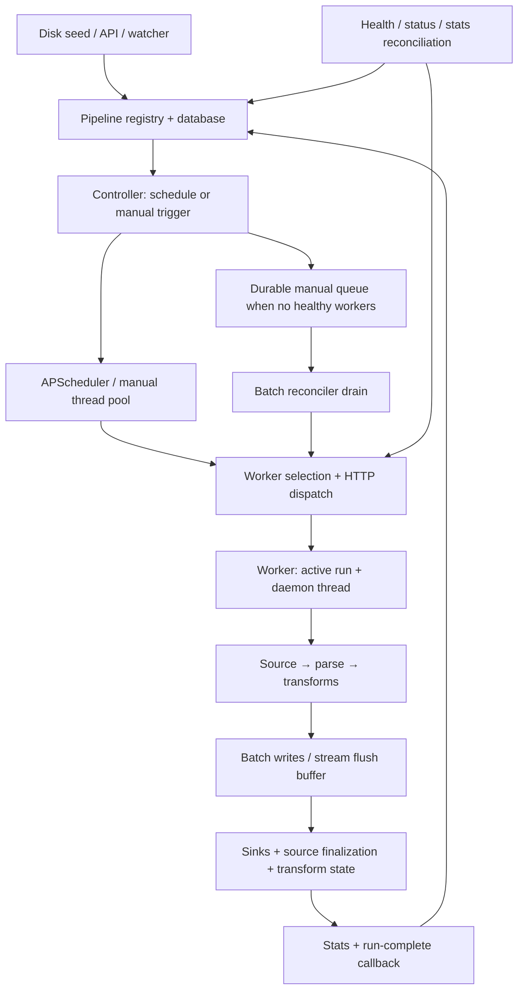

# Worker and pipeline reliability and performance review

Reviewed 2026-10-08 at commit `8e128dd` (v1.7.0 tree).

Scope: startup and configuration loading, pipeline CRUD, interval/cron/manual
scheduling, worker selection and admission, batch and stream execution, source
acknowledgements, sink publication, completion reporting, reconciliation,
shutdown, Kubernetes deployment, and existing performance evidence.

Method: static inspection of implementation and relevant existing tests, plus
review of committed benchmark reports. No tests, benchmarks, deployment changes,
or fault injection were run for this review. Findings below distinguish traced
code behavior from previously recorded measurements. Application code is unchanged.

The highest priority is execution ownership and delivery correctness. Current
paths can report success without durable output, lose track of an executing
batch, and start overlapping runs after recovery or administrative changes.
Throughput improvements are real, but do not establish a uniform delivery
guarantee across connectors or failure paths.

## Execution flow

Standalone execution uses the controller's executor in-process. Manager mode
uses worker HTTP dispatch; the chart deploys one manager. Stream placements and
queued manual requests are durable, while active batch assignments are held in
memory. These are materially different recovery contracts.

## Findings

P1 means a path that can lose data, permit overlapping execution, corrupt run
ownership, or leave an enabled pipeline unavailable. P2 means degraded capacity,
boundedness, or request semantics requiring correction. The ordering within each
priority reflects impact, not estimated implementation effort.

### R1 — P1: ClickHouse accepts output before it is durable and discards failed flushes

Evidence: [buffer flush](../../tram/connectors/clickhouse/sink.py#L91),
[close](../../tram/connectors/clickhouse/sink.py#L99),
[write](../../tram/connectors/clickhouse/sink.py#L160), and
[executor success](../../tram/pipeline/executor.py#L1533).

`write()` can return after merely appending to a local buffer. `_flush()` clears
the buffer before `_insert_rows()` succeeds. Timer and close flush failures are
logged and swallowed. The executor counts buffered rows as output and constructs
a successful batch result before sink close. A small batch followed by an insert
failure can therefore finish as success with zero durable rows. Kafka source
offsets can also be committed while ClickHouse still holds rows in memory.

Recommendation: introduce a sink flush/commit barrier before source acknowledgement,
file finalization, transform-state advancement, and run success. Retain failed
buffers and expose asynchronous write failures to the executor. Serialize flush
and close operations so a timer insert cannot outlive teardown unnoticed.

### R2 — P1: AMQP acknowledges before processing, even with `auto_ack: false`

Evidence: [AMQP callback](../../tram/connectors/amqp/source.py#L65).

The callback queues the message and immediately calls `basic_ack`. A worker
failure or downstream sink error after this point cannot recover that message
from RabbitMQ. `prefetch_count` also stops bounding application backlog once
messages are immediately acknowledged into an unbounded local queue.

Recommendation: retain delivery tags until the executor confirms durable sink
delivery or an explicit durable DLQ outcome. Send acknowledgements on the pika
connection's owning thread; nack/requeue unresolved deliveries on failure.

### R3 — P1: Processing failures bypass configured run retries; background stream errors bypass abort

Evidence: [global transform handling](../../tram/pipeline/executor.py#L826),
[sink failure handling](../../tram/pipeline/executor.py#L1104),
[chunk exception handling](../../tram/pipeline/executor.py#L1306),
[batch retry loop](../../tram/pipeline/executor.py#L1552),
[interval flusher](../../tram/pipeline/executor.py#L1957), and
[stream workers](../../tram/pipeline/executor.py#L2188).

For parse, transform, and exhausted sink-write failures, propagation generally
occurs only for `on_error == "abort"`. `on_error: retry` records/skips the failure
and lets the batch complete successfully instead of reaching its outer retry
loop. Sink-specific retries are separate and do not correct this behavior.
The existing parallel-sink exception test explicitly expects success and zero
writes under `on_error: retry` (`test_executor.py:843`).

In streams, the interval flusher and processing threads catch exceptions and
only log them, including exceptions raised under `on_error: abort`. The stream
buffer has already been drained when a write fails, so those records cannot be
retried from that buffer. File source finalization can still report success.

Recommendation: define explicit processing outcomes for delivered, filtered,
durably dead-lettered, retryable, and fatal results. Propagate fatal/retryable
outcomes across thread boundaries and retain or replay failed flush batches.
Make run status reflect the selected error policy.

### R4 — P1: Manager restart does not recover active batches before scheduling replacements

Evidence: [boot load](../../tram/pipeline/controller.py#L278),
[stream-only adoption](../../tram/pipeline/controller.py#L337),
[interval initial fire](../../tram/pipeline/controller.py#L950), and
[batch adoption candidates](../../tram/agent/reconciler.py#L426).

Boot rebuilds pipeline state from configuration and completed run history, then
schedules enabled batches. It does not persist or adopt active batch assignments
first. Interval pipelines with no recent completed run fire immediately. A batch
still executing on a worker can consequently overlap a new post-restart batch.
Manual batches are restored as stopped and are outside the reconciler's
`status == "running"` adoption candidates.

The queued-run boot reset also assumes nothing is in flight: a crash after a
worker accepts dispatch but before queue commit resets `dispatching` to `queued`,
allowing redispatch without checking the worker's actual execution first.

Recommendation: persist execution claims and assignments, reconcile accepted
runs before enabling scheduled dispatch, and recover ambiguous queued dispatches
by run ID. Keep desired schedule state separate from current execution state.

### R5 — P1: A failed status probe becomes a failed run, and stale callbacks/probes can remove a newer lease

Evidence: [unknown becomes inactive](../../tram/agent/worker_pool.py#L553),
[batch reconciliation](../../tram/agent/reconciler.py#L404),
[lost-run mutation](../../tram/pipeline/controller.py#L1345), and
[completion mutation](../../tram/pipeline/controller.py#L1409).

A single failed `/agent/status` probe returns `False` from `is_run_active`, and
the batch reconciler immediately records a lost run. This bypasses the worker
health debounce. The old worker can still be executing; subsequent schedule
ticks can start another run. A later success callback is ignored as a duplicate
because the synthesized failed result already exists.

Both callback branches pop the active batch lease by pipeline name without
checking its run ID. Retrying run A's callback after run B starts removes B's
lease. Similarly, a reconciler snapshot of A can return after A completes and B
starts; `mark_active_batch_run_lost` can pop B while recording a result for A.

Recommendation: use three liveness states: active, confirmed absent, unknown.
Require sufficient evidence before declaring loss. Compare run ID and execution
generation in every completion/lost-run transition and perform the update with
a conditional claim. Allow an authoritative completion to resolve an uncertain
outcome instead of permanently preserving a probe-generated failure.

### R6 — P1: Stop/update/restart do not cancel active batch execution

Evidence: [batch stop](../../tram/pipeline/controller.py#L1824),
[restart](../../tram/pipeline/controller.py#L510),
[worker stop](../../tram/agent/server.py#L728), and
[worker batch call](../../tram/agent/server.py#L651).

Batch stop only removes the scheduler job and changes pipeline status. It does
not stop the worker run. The agent's stop endpoint sets an event, but batch
execution never receives that event. Updating or restarting an interval pipeline
can therefore schedule the replacement while the old config is still writing.
An old completion can also change the new config's status or lease. Per-pipeline
transform-state writes have no generation fence, so overlapping old/new runs can
overwrite one another's state.

Recommendation: implement cooperative batch cancellation and a stopping/draining
state; do not start replacements until ownership is released or fenced. Scope
completion and transform-state updates to the execution generation that created
them. If a stop is intended to stop scheduling only, expose that behavior
explicitly and retain the active execution guard.

### R7 — P1: Worker SIGTERM does not drive graceful shutdown; drain deadlines are incomplete

Evidence: [worker server threads](../../tram/daemon/server.py#L197),
[worker shutdown](../../tram/agent/server.py#L437), and
[controller shutdown](../../tram/pipeline/controller.py#L261).

Both worker Uvicorn servers run in background daemon threads. Uvicorn installs
signal handlers on the main thread; the worker branch supplies no main-thread
SIGTERM handler or server shutdown coordination. Kubernetes SIGTERM therefore
does not initiate the intended worker lifespan drain. Whether termination occurs
immediately or after container grace depends on process signal disposition.

Even if lifespan shutdown runs, it sets run stop events without joining run
threads, and batches ignore the event. In standalone shutdown, the manual batch
pool waits indefinitely before stream joins; the configured timeout is not a
global deadline. Scheduled batches use APScheduler's separate executor and are
not drained by that manual pool.

Recommendation: supervise explicit Uvicorn server objects from the main thread,
stop admission/readiness, signal sources, drain runs and callbacks under one
deadline, then stop servers. Apply the same deadline to both batch executors,
stream processing, sink flushes, and telemetry. Align Kubernetes termination
grace with this protocol.

### R8 — P1: Enabled streams with no successful initial dispatch have no automatic recovery path

Evidence: [failed initial dispatch](../../tram/pipeline/controller.py#L1550),
[placement creation after acceptance](../../tram/pipeline/controller.py#L1578),
and [unplaced candidates](../../tram/pipeline/controller.py#L2064).

When no worker accepts the initial dispatch, the controller sets pipeline status
to `error` and creates no placement. The placement reconciler only sees existing
placements, and unplaced recovery only considers status `running`. Worker health
restoration nudges batch queue draining, not this stream. A manager starting
before workers are ready can leave enabled streams dead until manually started.

Recommendation: persist desired running state/placement intent even with zero
accepted slots and retry transient dispatch failures with bounded backoff.
Separate user-stopped state from recoverable capacity or transport errors.

Recorded operational evidence also reports no stream re-adoption after worker
rollout for 600–900 seconds in the v1.7 HTTP pilot. That observation warrants a
dedicated rollout investigation; this review does not claim R8 explains every
case of that recorded failure.

### R9 — P1: Lost dispatch responses and exhausted completion retries leave execution outcomes unresolved

Evidence: [dispatch](../../tram/agent/worker_pool.py#L636),
[agent duplicate check](../../tram/agent/server.py#L502),
[registration and thread start](../../tram/agent/server.py#L720), and
[completion retry exhaustion](../../tram/agent/server.py#L248).

If a worker starts a run but its HTTP response is lost, the manager records a
dispatch failure and no assignment. The next trigger/tick can execute another
run while the accepted one still runs. Agent duplicate detection is a separate
get then add, so concurrent requests for the same run ID can both pass it.
Completed run IDs are forgotten, permitting a later redispatch to execute again.

Completion has three attempts and no durable outbox or completed-results query.
After exhaustion the worker removes the run. Reconciliation can infer absence,
but cannot recover the actual success, counters, or error result.

Recommendation: treat a dispatch timeout as an uncertain outcome, resolve it
against an execution ledger, atomically reserve run IDs on workers, and retain
completion results until acknowledged. This supports controlled at-least-once
execution; it does not make arbitrary downstream sinks exactly-once.

### R10 — P1: Staged-file publication failure still permits destructive source finalization

Evidence: [swallowed sink finalize failure](../../tram/pipeline/executor.py#L768),
[source finalize after sink finalize](../../tram/pipeline/executor.py#L1733),
[publish rename](../../tram/connectors/file_sink_common.py#L705), and
[source mark/move/delete](../../tram/connectors/local/source.py#L156).

A failure to rename staged output into its final destination is converted to a
note. The executor then calls `source.finalize(success=True)`, allowing the input
to be marked processed, moved, or deleted. Data in a temporary file is not the
same as successfully published output. Subsequent temp cleanup or pod recreation
can remove the remaining copy.

The threaded batch path also omits the sequential path's `enable_safe_finalize`
and sink finalize hooks. Source finalization was deferred until futures drain,
but atomic file publication is still absent in that path.

Recommendation: require successful sink publication before acknowledging or
destroying the source unit. Preserve input and staged output on publication
failure. Make threaded/sequential paths use the same finalize protocol, or reject
configurations requiring atomic publication on an unsupported path.

### R11 — P1: Database initialization failure produces a ready but impaired manager

Evidence: [startup fallback](../../tram/api/app.py#L145),
[DB-only boot loading](../../tram/pipeline/controller.py#L218),
[DB-dependent reconcilers](../../tram/api/app.py#L226), and
[readiness](../../tram/api/routers/health.py#L53).

After six unsuccessful DB initialization attempts the app continues with
`db=None`. Disk seeding and controller boot loading cannot restore pipelines;
manager reconcilers are not created. Readiness rejects an unreachable existing
DB but accepts an absent DB. The deployment can appear ready with zero restored
pipelines and without durable queue/state/recovery, and has no later DB attach.

Recommendation: require persistence for manager mode, fail startup or stay
unready until it is available, and make any standalone ephemeral mode explicit.

### R12 — P2: Worker admission and placement do not bound aggregate work

Evidence: [one thread per accepted run](../../tram/agent/server.py#L715),
[load score](../../tram/agent/worker_pool.py#L369), and
[actual selection](../../tram/agent/worker_pool.py#L388).

Workers accept an unbounded number of runs, each with its own executor, source,
sinks, buffers, and potentially additional chunk/flush/watch threads. Healthy
does not mean available capacity. Concurrent dispatches select before reserving
capacity. Selection calls `resolve`, which uses a stable sort; the round-robin
`least_loaded` helper is not used by this dispatch path. Equal scores favor the
first configured worker.

The score switches between lifetime average bytes/second and active run count
multiplied by one million. These are not comparable capacity units. A CPU-heavy
quiet stream may score zero; recent assignments do not affect a score while
older stats exist. More worker replicas also do not split one batch pipeline.

Recommendation: use atomic per-worker reservations and enforced worker admission
limits, with separate batch/stream budgets. Include memory and CPU constraints,
recent throughput deltas, queue age, and readiness. Apply fairness among equal
candidates and explain single-batch scaling through explicit sharding.

### R13 — P2: Async management routes block the event loop on synchronous lifecycle work

Evidence: [update route](../../tram/api/routers/pipelines.py#L275),
[internal completion route](../../tram/api/routers/internal.py#L138),
[stream dispatch under lifecycle lock](../../tram/pipeline/controller.py#L1480),
and [sequential worker dispatch](../../tram/agent/worker_pool.py#L708).

Register/update/start/stop/restart/delete call synchronous controller methods
directly from async handlers. Stream dispatch and stop hold the global lifecycle
lock across worker HTTP calls, and service reconciliation uses synchronous
Kubernetes I/O. A broadcast operation can occupy the event loop for multiple
worker timeouts. Completion/stats/readiness requests are then delayed, contributing
to missed callbacks and false liveness conclusions. Parallel worker probes in
some read routes already use `run_in_threadpool`; mutations do not.

Recommendation: offload complete synchronous route operations, then shorten
lifecycle lock scopes with claim/perform/conditional-commit transitions. Set
explicit Kubernetes request deadlines and compensate accepted dispatches when
their intent was removed during network I/O.

### R14 — P2: Reconciliation and telemetry costs grow with runs instead of workers

Evidence: [per-run batch probe](../../tram/agent/reconciler.py#L408),
[serial cross-worker search](../../tram/agent/worker_pool.py#L569),
[serial stats emission](../../tram/agent/server.py#L319), and
[fresh HTTP clients](../../tram/agent/worker_pool.py#L126).

Every tracked batch probes its worker separately and serially. R unreachable
runs can consume roughly R × 5 seconds of read timeouts before queued requests
are drained; 100 such runs can delay a pass by about 500 seconds before other
overheads. Untracked searches probe every worker per pipeline. Worker stats are
also posted serially per run with a fresh client and ten-second timeouts. The
next emission waits until the previous sweep finishes, so telemetry freshness
degrades with active runs and manager outages.

Recommendation: obtain one bounded concurrent status snapshot per worker per
pass, then evaluate runs in memory. Batch stats per worker or use bounded
concurrency and reusable clients. Budget reconciliation passes and handle queue
expiry independently of potentially long liveness scans. Avoid creating an
unbounded thread per worker for every fan-out as the fleet grows.

### R15 — P2: Upstream bridge queues and persistent bookkeeping remain unbounded

Evidence: [AMQP queue](../../tram/connectors/amqp/source.py#L33),
[MQTT queue](../../tram/connectors/mqtt/source.py#L44),
[NATS queue](../../tram/connectors/nats/source.py#L42),
[WebSocket queue](../../tram/connectors/websocket/source.py#L66),
[syslog queue](../../tram/connectors/syslog/source.py#L395),
[stats store](../../tram/agent/stats_store.py#L18), and
[per-context errors](../../tram/core/context.py#L40).

Several source callbacks enqueue into `SimpleQueue` or an unlimited `Queue`.
The executor's bounded chunk queue does not backpressure those upstream queues.
A slow sink can exhaust worker memory while health remains green. AMQP/MQTT
also lack a `stop()` override, so the executor's stop watcher cannot unblock an
idle reader by setting the sources' private stop events.

The stream stats error window is capped, but the execution context's error list
continues growing for the lifetime of the stream. `StatsStore` excludes stale
entries on reads but does not evict them; crashed/replaced streams can leave
entries indefinitely. Completed queue/history/placement rows need a retention
policy as well. A webhook's message-count limit is not a byte budget: the defaults
allow 1000 messages of up to 10 MiB each, far beyond normal pod memory limits.

Recommendation: enforce byte and count budgets throughout source bridges and
buffering, define overflow behavior by connector, implement source stop hooks,
cap execution error samples, and add bounded retention/eviction.

### R16 — P2: Queued manual requests lose `flush` semantics and terminal cancellation visibility

Evidence: [explicit flag loss](../../tram/pipeline/controller.py#L542),
[queued dispatch payload](../../tram/agent/reconciler.py#L499), and
[queue deletion](../../tram/persistence/db.py#L1345).

A `flush=true` request accepted while no workers are healthy is later dispatched
as a normal run. Open aggregate windows are not flushed as requested. Stop/delete
purge queued rows without creating a terminal run result, so a previously
returned run ID can cease to resolve. Queue claim also derives schedule type
from current config while dispatching a stored YAML snapshot, which needs
generation consistency when an update races dispatch.

Recommendation: persist the full accepted request, including flush and config
generation, and retain cancelled/aborted terminal records under the returned run
ID. Define whether queued execution uses submission-time or dispatch-time config
and enforce that choice atomically.

## Delivery and deployment limits

| Path | Current practical guarantee |
|---|---|
| Kafka, single processing thread, synchronous durable sink, abort propagated | Poll-batch commit follows foreground flush; replay can duplicate partially delivered batches. Background flush failures and buffered sinks weaken this guarantee. |
| Kafka with `thread_workers > 1` | Source can commit while records remain queued. This loss window is acknowledged in the source/executor docstrings. |
| AMQP | Broker acknowledgement precedes pipeline processing, including with `auto_ack: false`. |
| Webhook | HTTP 202 confirms acceptance into memory, not durable processing. Process/pod loss can lose accepted requests. |
| File sources | Mark/move/delete follows processing, but publication failures and ignored processing outcomes can still finalize incompletely delivered units. |
| Stateful transforms | Best-effort per-pipeline snapshots; no transactional coupling to sink output/source offsets and no execution-generation fence. Window aggregates do not inherit the same self-healing reasoning as cumulative counters. |
| Local worker output / fallback DLQ spool under `/data` | Chart uses `emptyDir`; pod recreation loses data. Container restart within the same pod preserves `emptyDir`. These paths require durable storage or export if used as retained output/recovery data. |

The one-manager chart avoids concurrent manager scheduling by deployment policy.
It also leaves scheduling, durable state APIs, and completion reporting dependent
on that manager. Do not introduce multiple managers without durable ownership
claims and fencing. In-memory APScheduler jobs do not preserve every missed
cron/interval occurrence through downtime; coalescing/skipping policy should be
an explicit operational contract.

## Performance evidence and interpretation

Use the [corrected v1.6 comparison](../ideas/perf-v160-vs-v151-comparison-2026-10.md)
and [follow-up assessment](../ideas/perf-followup-assessment-2026-10-07.md).
The original v1.5 capacity study contains contaminated cells and inflated
H-profile values; its reported topology penalty is not a current finding.

| Recorded result | Interpretation |
|---|---|
| Kafka consumption on one 500m worker: 2000 messages/s without lag; 3943/s matching production | A demonstrated operating point. The stronger run was producer limited, so it does not establish saturation capacity. |
| Webhook on three 500m workers: about 1605 requests/s at lower concurrency, 1284 at higher concurrency | Client concurrency changes usable capacity. Size for latency and overload behavior, not a single plateau rate. |
| Five-transform JSON chain: 23,942 records/s standalone, 29,040 manager/worker at 500m | Earlier expression/copy optimizations already improved this substantially. They are not an outstanding backlog. |
| JSON / MessagePack format sweep at M: 72,917 / 133,929 records/s | Workload-specific measurements, not universal serializer capacities. |
| v1.7 HTTP pilot: 500 rps p95 3.05 → 1.76 ms, plateau improvement about ±6% | Accelerated HTTP helps latency; it did not meet the sustainable-throughput target. Downstream execution remains important. |
| v1.7 eligible Protobuf passthrough: median 333,333 records/s versus 11,111 anchor; RSS 151 versus 247 MiB | Strong measured gain for the eligible path, with byte hashes checked. Runs lasted about 0.3–0.4 seconds; longer steady-state and mixed-load measurements are needed for capacity planning. |

Pilot sources: [HTTP results](../../scripts/perf/results/v170-http-pilot/README.md)
and [Protobuf results](../../scripts/perf/results/v170-passthrough-pilot/README.md).

Additional code-based optimization candidates: reuse the per-chunk parallel-sink
executor (`executor.py:1137`); pool REST sink HTTP connections
(`rest/sink.py:77`); avoid lifetime throughput averages for placement; and measure
the complete cost of per-record locks/metrics and global transform dispatch.
These are hypotheses to benchmark, not measured gains from this review.

## Recommended repair sequence

1. **Delivery correctness:** fix ClickHouse commit/flush, AMQP acknowledgement,
   retry/abort propagation, and staged-file publication before source finalization.
2. **Execution ownership:** persist batch claims, add run/config generations,
   resolve uncertain dispatches, compare IDs on callbacks/recovery, and recover
   live batches before starting schedules. Retain completion results until acknowledged.
3. **Lifecycle:** implement worker SIGTERM supervision, cooperative batch cancel,
   desired-state stream recovery, and one shutdown/drain deadline. Require manager
   persistence and readiness prerequisites.
4. **Capacity:** enforce worker and source budgets, offload blocking API work,
   shorten lock scopes, reuse status snapshots/HTTP connections, and make placement
   reservation-aware. Preserve full queued request semantics and terminal audit.
5. **Measurement:** establish workload-specific latency/throughput/recovery SLOs
   after correctness changes, using sink-observed durable delivery as the numerator.

## Recommended validation campaign

These are proposed checks, not checks executed for this review:

- Drop the dispatch response after worker acceptance; retry the same request;
  send duplicate concurrent run IDs; verify execution ownership and terminal outcome.
- Restart the manager during a long interval batch and during queue dispatch;
  deliver an old completion after a replacement starts; verify no lease is removed
  for a different run and no overlapping unfenced writes occur.
- Fail one status probe during a healthy batch; separately kill its worker;
  verify unknown versus confirmed lost behavior and recovery latency.
- Fail ClickHouse timer/final flush, file publish rename, and AMQP downstream write;
  compare durable sink IDs with source acknowledgements, processed-file flags,
  transform state, and run status.
- Fail a quiet stream's interval flush and a threaded stream's write under abort;
  verify the supervising run fails and records remain recoverable.
- Start the manager before workers and while the DB is unavailable; roll workers;
  require automatic recovery of enabled pipelines and honest readiness.
- SIGTERM workers under active buffered streams and long batches; measure drain,
  callback completion, sink durability, and queue replay within the configured deadline.
- Sweep active pipeline/run counts (for example 10/100/1000), offered rate, payload
  size, slow-sink delay, and worker CPU quota. Measure p95/p99 end-to-end delivery
  latency, callback latency, event-loop lag, queue bytes/age, RSS, CPU throttling,
  reconciliation pass duration, and recovery time.
- Use independent load generation and sustained runs; isolate CPU-bound transform,
  file, webhook, Kafka, and network-bound workloads. Record offered, accepted,
  durably delivered, skipped, dead-lettered, duplicated, and replayed IDs separately.

Existing strengths to retain: controller lifecycle locking, bounded batch
in-flight chunks, bounded executor stream queues, serialized stream sink flushes,
Kafka explicit foreground commit-after-flush, worker health hysteresis, durable
stream placements/manual queue, batched processed-file tracking, stateful parallelism
validation, and the measured format/transform optimizations. Their presence does
not close the failure boundaries identified above.
